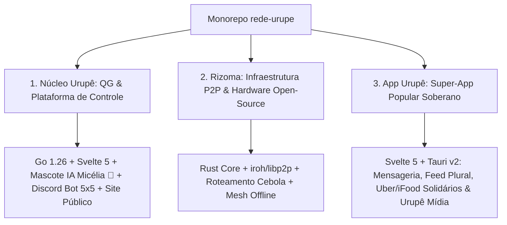

# 🌿 Frente Urupê: Ecossistema Monorepo

> **"Pela Soberania Digital, Emancipação Popular e Organização Ecossocialista."**

O repositório **`rede-urupe`** é o monorepo unificado da **Frente Urupê**. Ele engloba a documentação teórica e o código-fonte da nossa **Trindade de Produtos**: o **Núcleo Urupê** (QG & Plataforma de Controle), o **Rizoma** (Protocolo P2P Local-First & Hardware Open-Source) e o **App Urupê** (Super-App Popular Soberano).

---

## 🏛️ A Trindade de Produtos



### 1. 🏛️ Núcleo Urupê (`projetos/nucleo-urupe`)
Central de inteligência e controle da Frente Urupê.
- **Site Público & CMS:** Portal oficial institucional (Web2/HTTPS) integrado à malha P2P.
- **Mascote IA Micélia 🍄 & Discord 5x5:** Moderação pedagógica, de-escalada afetiva e governança.
- **Spore Ops (Agitprop & Guerrilha):** Clipping de mídias, criação de pacotes de ação e envio de campanhas.

### 2. 🌿 Rizoma (`projetos/rizoma`)
Infraestrutura descentralizada e anti-predatória.
- **Web3 Real (Sem Criptomoedas/NFTs):** Dados local-first, encriptados e soberanos.
- **Resiliência a Censura:** Operação online com capacidade de malha P2P offline (Wi-Fi Direct/Bluetooth) para atos públicos.
- **Hardware Open-Source (Rizoma Box):** Firmware para micro-computadores comunitários.

### 3. 📱 App Urupê (`projetos/app-urupe`)
Super-App de uso diário do militante e da classe trabalhadora (Escala WeChat Soberano).
- **Módulo 0 (Mensageria Soberana):** Chat P2P instantâneo com assistente IA Micélia e cofre de pânico (ZKP).
- **Módulo 1 (Feed Plural):** Cultura, humor, memes, luta de classes, formação política e vlogs.
- **Módulo 2 (Mapa Territorial & Logística):** Mobilidade soberana ("Uber Popular") e entregas solidárias ("iFood Popular") sem taxas extrativistas.
- **Módulo 3 (Biblioteca & IA Correlacionadora):** Acervo offline com correlação temática automática de saberes.
- **Módulo 4 (Identidade Soberana):** Autenticação descentralizada por Provas de Zero-Conhecimento (ZKP - Zero 1984).
- **Módulo 5 (Urupê Mídia):** Cortes obrigatoriamente vinculados a vídeos longos, transcrição por IA, rádios, podcasts e TV ao vivo.

---

## 📂 Estrutura do Monorepo

```
rede-urupe/
├── README.md                  <- Guia Mestre & Manifesto do Monorepo
├── .gitignore                 <- Proteção de senhas, binários e SQLite local
│
├── docs/                      <- 🧠 PKM / Base de Conhecimento Estratégico
│   ├── 01-manifesto/          <- Manifesto, Visão Ecossocialista e Teoria
│   ├── 02-arquitetura/        <- Manifesto Revolucionário e Schemas da Malha
│   ├── 03-produtos/           <- Detalhamento Profundo dos Módulos dos 3 Pilares
│   └── 04-discord/            <- Matriz Ontológica 5x5 do Servidor Discord
│
├── projetos/                  <- 💻 Código-Fonte da Trindade de Produtos
│   ├── nucleo-urupe/          <- Plataforma de Controle (QG)
│   │   ├── nucleo-engine/     <- Backend Go 1.26 + Engine Talos + Discord Bot
│   │   └── nucleo-ui/         <- Dashboard Svelte 5 + CMS do Site Público
│   ├── rizoma/                <- Motor P2P & Hardware em Rust
│   └── app-urupe/             <- Super-App Svelte 5 + Tauri v2 (Mobile/Web/Desktop)
│
└── assets/                    <- 🎨 Artes, logotipos e ilustrações da Micélia
```

---

## ⚡ Desenvolvimento & Execução

### Núcleo Urupê (Backend Go)
```bash
cd projetos/nucleo-urupe/nucleo-engine
CGO_ENABLED=0 go build -o nucleo_bot ./cmd/bot
```

### Núcleo Urupê (Frontend Svelte 5)
```bash
cd projetos/nucleo-urupe/nucleo-ui
bun install
bun run build
```

---

*Frente Urupê — 2026*
