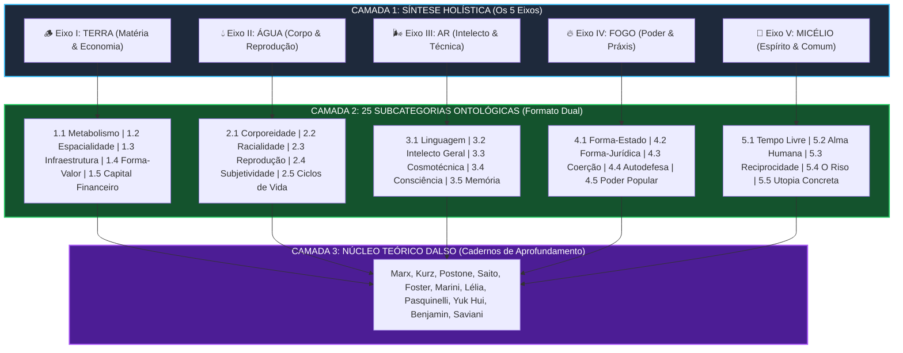
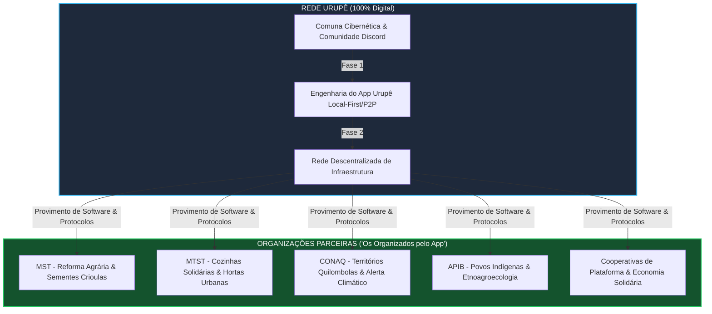
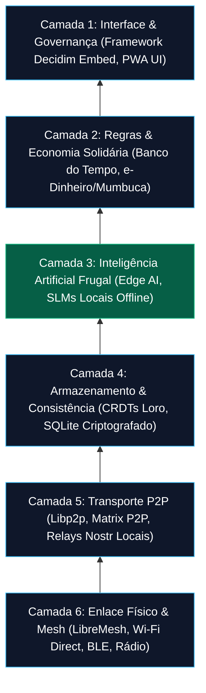

# Mapa Visual de Arquitetura Sistêmica — Rede Urupê

> **Visualização Diagramática do Ecossistema, da Matriz Ontológica 5x5 e da Pilha Técnica**

---

## 1. A Matriz Ontológica 5x5 e as 3 Camadas Pedagógicas

O diagrama abaixo ilustra a estrutura fractal de formação política da Rede Urupê: a apreensão holística dos **5 Eixos Ontológicos** (Camada 1), o desdobramento nas **25 Subcategorias Universais** (Camada 2) e o aprofundamento nos **Cadernos Teóricos** (Camada 3).

---

## 2. O Ecossistema Micelar da Rede Urupê

Separacão de papéis entre a **Rede Urupê** (teoria, software e infraestrutura P2P) e as **Organizações Parceiras** (movimentos sociais e populares).

---

## 3. A Pilha de Cosmotécnica & Arquitetura do App Urupê

---

## 4. O Ciclo da Desintoxicação Algorítmica e Práxis Freiriana

```mermaid
flowchart LR
    subgraph REDES_CORPORATIVAS ["Plataformas das Big Techs"]
        X1[Vício em Dopamina & Telas] --> X2[Algoritmo de Ódio & Pânico Moral]
        X2 --> X3[Ideologia do 'Empreendedorismo de Si']
        X3 --> X4[Isolamento, Ansiedade & Passividade]
    end

    subgraph TRANSIÇÃO_URUPÊ ["Práxis com App Urupê"]
        Y1[Custódia Local-First & Foco] --> Y2[Círculos Digitais de Escuta Freiriana]
        Y2 --> Y3[Conscientização Anti-Ressentimento]
        Y3 --> Y4[Coordenação P2P de Ação Direta Comunitária]
    end

    X4 -.->|Desintoxicação Digital| Y1

    style REDES_CORPORATIVAS fill:#7f1d1d,stroke:#ef4444,color:#fff
    style TRANSIÇÃO_URUPÊ fill:#14532d,stroke:#22c55e,color:#fff
```

