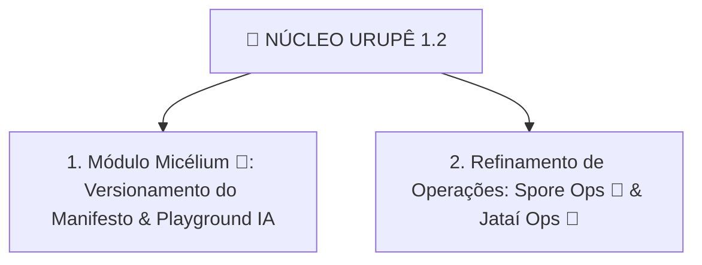

# 🍄 Núcleo Urupê 1.2: Refinamento do Micélium & Operações

> **"Sem dispersão. Foco absoluto no refinamento de alta precisão do motor de IA Micélium 🍄 (com versionamento histórico de teses e manifesto) e nas centrais operacionais Spore Ops e Jataí Ops."**

---

# 📐 As Duas Frentes Únicas do Núcleo Urupê 1.2

---

### 📖 1. Módulo Micélium 🍄 & Versionamento do Manifesto

#### A. Controle de Versionamento de Teses & Manifesto (`ManifestoVersioning`)
- **Histórico Completo de Versões:** Sistema de versionamento (`v1.0`, `v1.1`, `v1.2`, etc.) para o Manifesto Ecossocialista da Frente Urupê.
- **Diffs de Edição:** Comparador visual entre edições passadas e a edição atual do manifesto.
- **Changelog & Autor:** Registro imutável no SQLite (`data/nucleo.db`) de quem editou, quando editou e qual foi a alteração ideológica realizada.
- **Sincronização em Cascata:** Ao aprovar uma nova versão `v1.x` do manifesto:
  1. Atualiza a landing page pública.
  2. Sincroniza a introdução dos **5 Fóruns Fixos do Discord** (`i-mundo`, `ii-sociedade`, `iii-cosmotecnica`, `iv-praxis`, `v-espirito`).
  3. Re-indexa o texto no motor de busca FTS5 da Micélia com a tag de versão ativa.

#### B. Laboratório Cognitivo & Gestão da Micélia 🍄 (`MiceliumLab`)
- **Playground dos 7 Estágios da Arandu Engine:** Teste em tempo real da Micélia no Admin, exibindo visualmente cada uma das 7 fases de raciocínio (Gater ➔ Memory ➔ Persona ➔ Planner ➔ Executor ➔ Evaluator ➔ Learning).
- **Gerenciador de Memórias Episódicas:** Interface para listar, filtrar por relevância, editar ou remover cápsulas de memória gravadas durante conversas no Discord e na Web.
- **Ingestão de Documentos:** Carregador de arquivos de formação política em texto/PDF para aprendizado imediato da IA.

---

### 🧫 2. Refinamento de Operações: Spore Ops 🍄 & Jataí Ops 🐝

#### A. Refinamento do Spore Ops 🍄 (Guerrilha Digital & Clipping)
- **Painel de Acompanhamento de Pautas:** Interface para monitorar pautas da imprensa e redes sociais.
- **Gerenciador de Campanhas de Imprensa & Memes:** Visualizador de pacotes de ação direta e material de agitação pronto para distribuição pelos militantes.

#### B. Refinamento do Jataí Ops 🐝 (Frota B2B & Autofinanciamento)
- **Painel de Transparência de Custos:** Acompanhamento do faturamento das frotas comerciais B2B (Vico, RH, etc.) e medição exata do consumo de tokens.
- **Status da Frota de Robôs:** Indicador em tempo real da saúde dos agentes em produção.
