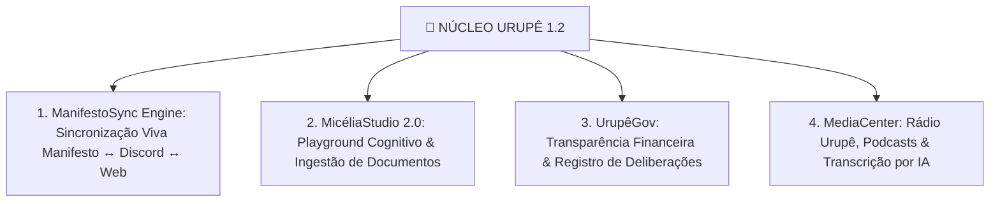

# 🍄 Núcleo Urupê 1.2: A Central de Governança, Cognição & Mídia Soberana

> **"Sincronização viva do Manifesto com o Discord, treino avançado da Micélia 🍄, transparência total do autofinanciamento e gestão de mídias da revolução."**

---

# 📐 As 4 Pilastras do Núcleo Urupê 1.2

---

### 📖 1. ManifestoSync Engine (Sincronização Viva do Manifesto)
- **Editor do Manifesto no Admin (`nucleo-ui`):** Interface para a coordenação editar capítulos, seções e teses do Manifesto Ecossocialista da Frente Urupê.
- **Sincronização Tripla Automática:** Ao salvar uma nova versão do Manifesto:
  1. Atualiza imediatamente a exibição no Site Público (`PublicLandingView`).
  2. Atualiza a introdução e tópicos fixos dos **5 Fóruns de Informações no Discord** (`i-mundo`, `ii-sociedade`, `iii-cosmotecnica`, `iv-praxis`, `v-espirito`).
  3. Re-indexa os parágrafos na memória FTS5 da **Micélia 🍄**, fazendo com que a IA passe a responder com as novas diretrizes teóricas no exato segundo da atualização!

---

### 🍄 2. MicéliaStudio 2.0 (Playground Cognitivo & Treino da IA)
- **Playground de Testes no Admin:** Espaço para os administradores testarem perguntas e analisarem os 7 estágios de raciocínio da Micélia em tempo real antes de liberá-la em novos canais.
- **Ingestão de Cartilhas & Livros:** Upload de arquivos PDF/Texto (obras de formação política, manuais, acordos) para indexação direta na memória episódica da IA.
- **Aprovação Dialética de Memórias:** Interface para a coordenação aprovar, editar ou descartar sínteses aprendidas pela Micélia durante interações no Discord.

---

### 🛡️ 3. UrupêGov (Portal de Transparência & Governança)
- **Transparência do Fundo Urupê:** Exibição pública e no Admin do faturamento gerado pela fábrica **Jataí 🐝** (robôs comerciais B2B como Vico, RH, etc.) e o destino exato de cada centavo em infraestrutura livre.
- **Livro de Atas & Deliberações:** Registro imutável de pautas aprovadas nas assembleias da Frente Urupê.

---

### 📻 4. MediaCenter & Rádio Urupê (Mídias & Podcasts)
- **Central de Áudio & Podcasts:** Publicação e organização de programas da Rádio Urupê, episódios de podcasts e discursos.
- **Transcrição por IA (Whisper):** Transcrição automática de áudio para texto, permitindo que todo o acervo falado seja pesquisável e compreendido pela Micélia 🍄.
