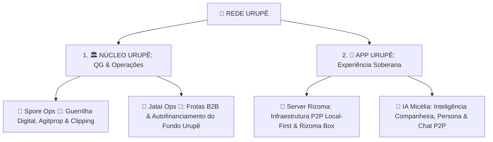

# 🌲 Ramos do Ecossistema Rede Urupê

> **"A separação clara entre a Plataforma Operacional de Governança (Núcleo Urupê) e a Experiência Soberana Descentralizada do Militante (App Urupê)."**

---

# 📐 Mapeamento dos 2 Ramos Principais

---

## 1. 🏛️ Ramo NÚCLEO URUPÊ (QG Operacional, Institucional & Governança)
* **Natureza:** Plataforma de Controle e Governança da Frente Urupê (Go 1.26 + Svelte 5).
* **Escopo:**
  - **Spore Ops 🍄:** Central de inteligência memética, agitação & propaganda popular, clipping de imprensa e disparos de mídias.
  - **Jataí Ops 🐝:** Central de frotas industriais B2B (*Vico ⚖️*, RH) e controle de caixa do **Fundo Urupê**.

---

## 2. 📱 Ramo APP URUPÊ (Experiência Soberana do Militante & P2P)
* **Natureza:** Super-App Popular descentralizado na mão do trabalhador (Svelte 5 / Tauri v2 + Rust).
* **Escopo:**
  - **Server Rizoma 🌾:** A infraestrutura P2P local-first em Rust (criptografia Ed25519, libp2p/iroh, rede mesh offline e nós comunitários *Rizoma Box*).
  - **IA Micélia 🍄:** A assistente inteligente local e companheira pedagógica que apoia o militante no chat P2P, organiza mídias e correlaciona saberes sem extração de dados corporativos.
