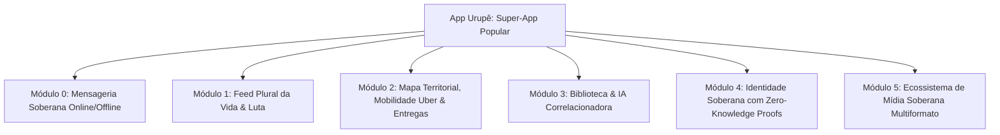

# Manifesto & Arquitetura Revolucionária da Frente Urupê (Versão Refinada)

Este documento estabelece a arquitetura final e realista da **Frente Urupê**, combinando a plataforma de controle (**Núcleo Urupê**), a infraestrutura descentralizada (**Rizoma**) e o super-aplicativo popular (**App Urupê**).

---

# 🏛️ 1. NÚCLEO URUPÊ: A Central de Comando & CMS Institucional

Plataforma de controle do ecossistema da Frente Urupê. Opera o **Site Público Institucional** e a **Central Admin**.

```mermaid
graph TD
    subgraph SITE PÚBLICO [Portal Web Aberto]
        LAND[Landing Page & Manifesto]
        ART[Artigos & Jornalismo da Frente]
        AGENDA[Agenda de Lutas & Notícias]
    end

    subgraph PORTAL ADMIN [Central de Comando Interna]
        CMS[CMS de Gestão do Site Público]
        DISC[Integração & Controle 5x5 do Discord]
        MICE[Central Micélia 🍄: Prompts, Memórias & IA]
        SPORE[Spore Ops: Guerrilha & Agitprop]
        CAIXA[Caixa Comunitário & Transparência]
        GOV[Assembleias & Votações Diretas]
    end

    CMS -->|Publica via HTTPS| SITE PÚBLICO
    CMS -->|Assina e Injeta P2P| RIZOMA[Malha Rizoma P2P]
```

### Funcionalidades do Núcleo Urupê:
1. **Site Público + CMS Interno:** Publicação de notícias, manifesto e artigos no site público via HTTPS e injeção automática na rede P2P do App Urupê.
2. **Controle 5x5 do Discord:** Gestão do servidor, cargos, salas de reunião e moderação afetiva.
3. **Central da Mascote Micélia 🍄:** Controle de prompts, memórias episódicas (FTS5), aprovação de aprendizados e inspeção de conversas.
4. **Spore Ops (Guerrilha & Agitprop):** Clipping de redes, radar de mídias e envio de pacotes de ação (memes, vídeos, hashtags) para os militantes.
5. **Caixa Comunitário & Transparência:** Livro-razão aberto de doações e recursos.
6. **Assembleias Diretas:** Votações formais, apuração e atas automáticas.

---

# 🌿 2. RIZOMA: A Infraestrutura Descentralizada Anti-Predatória

A infraestrutura que garante que os dados sejam soberanos, sem intermediários corporativos ou algoritmos extrativistas.

1. **Online por Padrão, Offline por Resiliência:** Funciona na internet normal (3G/4G/5G/Wi-Fi) de alta velocidade, mas possui capacidade de malha P2P (Wi-Fi Direct/Bluetooth) para continuar operando mesmo em situações de corte de sinal ou apagão.
2. **Identidade Criptográfica Ed25519:** Sem necessidade de cadastro via Google/Meta.
3. **Servidor Híbrido & Hardware Open-Source:** Roda em servidores de nuvem, micro-servidores comunitários (*Rizoma Box*) e nos próprios celulares dos usuários.

---

# 📱 3. APP URUPÊ: O Super-App Popular Soberano (Escala WeChat)

O **App Urupê** é o aplicativo de vida diária do militante e da classe trabalhadora, unindo comunicação, trabalho, cultura, mídia e solidariedade.



---

### 🧱 Módulos Detalhados do App Urupê:

#### 💬 Módulo 0: Mensageria Soberana Online (Substituto do WhatsApp & Telegram)
- **Online & Instantâneo por Padrão:** Envio rápido de texto, áudios longos, imagens, vídeos e chamadas via 3G/4G/5G/Wi-Fi com criptografia ponta-a-ponta nativa (E2EE).
- **Sem Espionagem Corporativa:** Sem Meta ou Telegram lendo metadados ou banindo contas arbitrariamente.
- **Malha Local de Emergência:** Caso o sinal seja cortado em um ato público, o app chaveia automaticamente para mensagens via Bluetooth/Wi-Fi Direct local.

---

#### 📰 Módulo 1: Feed Plural da Vida, Cultura & Luta Popular
O feed não se limita a textos teóricos acadêmicos. Ele reflete a totalidade da vida da classe trabalhadora em 5 frentes principais:
1. **Vida Cotidiana & Cultura Popular:** Arte, música, culinária regional/agroecológica, memes militantes, esportes de várzea e causos do dia a dia.
2. **Organização Política & Luta de Classes:** Notícias de greves, movimentos de moradia/terra, informes das brigadas e denúncias comunitárias.
3. **Formação & Ciência:** Artigos científicos, tecnologia livre, debates teóricos e saúde popular.
4. **Ecologia & Autodesenvolvimento:** Permacultura, plantio urbano, saúde mental comunitária e saberes tradicionais/indígenas/quilombolas.
5. **Criação Livre de Conteúdo (Vloggers & Criadores Populares):** Vídeos curtos e longos de criadores independentes da periferia sem a censura de algoritmos Big Tech.

---

#### 🗺️ Módulo 2: Mapa Territorial, Mobilidade & Logística Popular (Uber & iFood Solidários)
Transforma a presença digital em suporte concreto ao trabalho e à vida no território:
- **Mobilidade Soberana ("Uber Popular"):** Conexão direta entre motoristas/ciclistas da comunidade e passageiros/militantes. **Zero taxa de exploração de 30%-40%**: 100% do valor do transporte fica com o trabalhador.
- **Entregas & Cesta Agroecológica ("iFood Popular"):** Entrega de refeições de cozinhas comunitárias, produtos da agricultura familiar, remédios e artesanato entregues por trabalhadores locais.
- **Mapa de Mutirões & Apoio Mutuo:** Marcação no GPS de hortas comunitárias, pontos de coleta de doações, feiras populares e zonas de perigo durante manifestações.

---

#### 📚 Módulo 3: Biblioteca Viva & IA Correlacionadora (Micélia Cognitiva)
- **Biblioteca Offline:** Acervo de livros, cartilhas, revistas e manuais baixados direto no dispositivo.
- **Micélia Correlacionadora:** Ao ler um post no feed ou ver um vídeo sobre "transporte público", a Micélia correlaciona automaticamente o artigo científico sobre passe livre, o livro na biblioteca e os motoristas da cooperativa de mobilidade mais próximos no Mapa!

---

#### 🛡️ Módulo 4: Identidade Soberana por Provas de Zero-Conhecimento (ZKP)
- **Proteção Absoluta Contra Vigilância (Zero 1984):**
  - **Zero-Knowledge Proofs (ZKP):** O militante/motorista/entregador pode provar que é um membro verificado ou trabalhador da cooperativa **SEM revelar seu nome real, CPF ou localização física** para a rede.
  - **Web of Trust (Teia de Confiança):** Validação mútua entre pares conhecidos no mundo real, sem notas ditadas por algoritmos punitivos.

---

#### 📺 Módulo 5: Ecossistema de Mídia Soberana Multiformato (Urupê Mídia)
Substituição completa do ecossistema de mídias corporativas:
1. **Urupê Vídeo (Substituto do YouTube/TikTok):** Streaming de vídeos curtos (cortes/vlogs) e vídeos longos (documentários, aulas, programas).
2. **Urupê Áudio & Rádios (Substituto do Spotify/Podcasts):** Transmissão de rádios comunitárias ao vivo, programas de áudio, podcasts e músicas de artistas da periferia.
3. **Urupê Publicações (Substituto do Substack/Medium):** Jornais de bairro, zines digitais e blogs militantes.
4. **Urupê TV Ao Vivo:** Transmissão em tempo real de atos, assembleias, debates e eventos culturais.

---

# 📊 Comparativo do Super-App Urupê

| Função | Aplicação Comercial Big Tech | **App Urupê (Super-App Soberano)** |
| :--- | :--- | :--- |
| **Mensagens** | WhatsApp / Telegram (comercial/espionado) | Mensageria P2P E2EE Online + Backup Offline |
| **Transporte** | Uber / 99 (30%-40% de taxa extrativista) | Mobilidade Soberana (100% para o motorista) |
| **Entregas** | iFood (taxas altas sobre restaurantes) | Entregas Populares & Cesta Agroecológica |
| **Vídeo & Áudio** | YouTube / TikTok / Spotify (algoritmos caóticos) | Urupê Mídia (Vídeo, Áudio, Rádios e TV Ao Vivo) |
| **Privacidade** | Coleta massiva de dados e perfilamento | Identidade Soberana via Zero-Knowledge Proofs |
