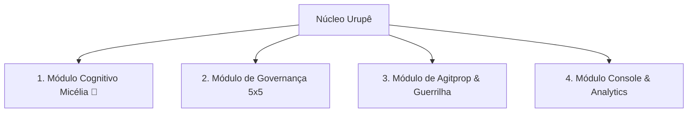
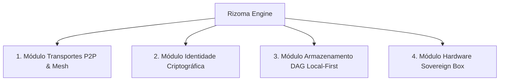
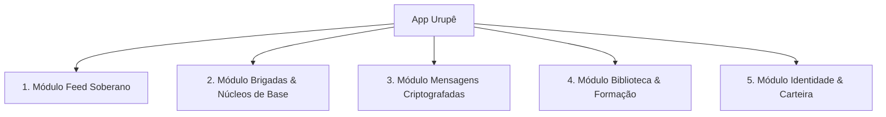

# Detalhamento Profundo: Perfis, Usabilidade e Módulos da Frente Urupê

Este documento especifica a visão de produto, a experiência do usuário (UX/UI) e a arquitetura de módulos funcionais de cada um dos 3 pilares da **Frente Urupê**.

---

# 1. NÚCLEO URUPÊ
> **A Central de Controle, Governança, Inteligência e Agitprop da Frente Urupê**

### 🎯 Perfil Geral
O **Núcleo Urupê** é a central de operações e inteligência da Frente Urupê. Ele integra o Discord institucional, o Portal Web e redes sociais oficiais, conectando a comunidade a um motor de IA de última geração impulsionado pela mascot **Micélia 🍄**.

- **Público-Alvo:** Coordenadores da Frente, equipe de comunicação e agitprop, moderadores de comunidade e militantes organizadores.
- **Proposta de Valor:** Automatizar a moderação pedagógica, monitorar redes sociais, centralizar a governança comunitária e orquestrar campanhas digitais sem sobrecarregar a militância humanitária.

---

### 🖥️ Usabilidade & Experiência do Usuário (UX/UI)
- **Console Web (`nucleo-ui`):** Dashboard com estética *dark glassmorphism*, tipografia serifada elegante, métricas atualizadas em tempo real via Server-Sent Events (SSE) e controles visuais intuitivos.
- **Interface Discord:** Respostas afetuosas e orgânicas da mascot **Micélia 🍄**, uso de embeds estruturados, botões de ação e moderação sem atritos punitivos.

---

### 🧱 Módulos Funcionais do Núcleo Urupê

1. **Módulo Cognitivo Micélia 🍄 (`talos/v2` Engine):**
   - **Triagem em 7 Estágios (Gater):** Avaliação de contexto antes de responder no Discord.
   - **Memória Episódica FTS5:** Consulta a fatos consolidados e histórico de interações dos membros.
   - **De-escalada Afetiva:** Mediação de conflitos e acolhimento de novos membros.
   - **Studio de Persona:** Editor visual de identidade, estilo e valores da Micélia.

2. **Módulo de Governança Ontológica 5x5:**
   - **Provisionador Autônomo:** Automação de 5 Categorias e 25 Canais no Discord (`/admin provision-5x5`).
   - **Gestão de Pautas & Atas:** Registro autônomo de assembleias, contagem de votos e geração de resumos executivos.

3. **Módulo de Agitprop & Guerrilha Digital (Micélia Ops):**
   - **Radar de Mídias & Clipping:** Coleta de notícias e tendências do cenário político/social.
   - **Central de Brigadas:** Criação e distribuição de pautas de ação, ideias de memes, artes e cortes de vídeo.
   - **Injeção P2P:** Publicação automática de pautas aprovadas diretamente no feed do **App Urupê** via rede **Rizoma**.

4. **Módulo Console & Analytics:**
   - **Monitor de Custos & Tokens:** Transparência nos gastos com LLMs.
   - **Revisor de Aprendizado:** Aprovação de propostas de novos fatos e comportamentos aprendidos pela IA.

---

# 2. RIZOMA
> **A Tecnologia de Servidor Descentralizado, Hardware Open-Source e Protocolo P2P**

### 🎯 Perfil Geral
O **Rizoma** é a infraestrutura invisível, soberana e antifrágil da Frente Urupê. Inspirado no conceito botânico e filosófico de rizoma, ele permite que a rede funcione de forma totalmente descentralizada, sem dependência de servidores centrais da Big Tech.

- **Público-Alvo:** Desenvolvedores, sysadmins da militância, operadores de nós comunitários (*Rizoma Box*) e a infraestrutura interna do App Urupê e Núcleo Urupê.
- **Proposta de Valor:** Garantir que a comunicação e os dados da Frente permaneçam acessíveis mesmo sob censura, quedas de internet ou bloqueios de infraestrutura.

---

### 🖥️ Usabilidade & Experiência do Usuário (UX/UI)
- **Modo Embarcado (Invisível):** Roda silenciosamente dentro do App Urupê (no celular) e do Núcleo Urupê (no servidor).
- **TUI/CLI para Operadores:** Interface de linha de comando estilizada em Rust para visualização de pares conectados, velocidade de sincronização e integridade do nó.
- **Hardware Open-Source (Rizoma Box):** Firmware para Raspberry Pi / micro-PCs com indicador LED de saúde da rede e conectividade Wi-Fi/mesh local.

---

### 🧱 Módulos Funcionais do Rizoma

1. **Módulo Transportes P2P & Mesh (`iroh` / `libp2p-rs`):**
   - **Descoberta Local & Relays:** Descoberta de pares via mDNS local e relays públicos.
   - **Rede Mesh Offline (Wi-Fi Direct / Bluetooth):** Troca de dados ponto-a-ponto entre celulares próximos em protestos ou áreas rurais sem sinal de celular.
   - **Hole-Punching NAT:** Conexão direta entre nós mesmo atrás de roteadores e firewalls domésticos.

2. **Módulo de Identidade Criptográfica & Soberania:**
   - **Chaves Ed25519:** Cada nó e usuário possui sua chave criptográfica própria.
   - **DIDs (Decentralized Identifiers):** Identidade soberana sem necessidade de e-mail ou número de telefone centralizado.
   - **Assinatura de Eventos:** Impedimento de falsificação de postagens ou comunicados institucionais.

3. **Módulo Armazenamento DAG & CRDTs (`automerge` / SQLite):**
   - **Sincronização Eventual Sem Conflito (CRDTs):** Permite que edições e postagens feitas offline se fundam perfeitamente assim que o nó encontra um par.
   - **Criptografia em Repouso:** Dados locais encriptados no dispositivo.

4. **Módulo Hardware Sovereign Box (Rizoma Box):**
   - **Firmware Leve (Alpine Linux / NixOS):** Imagem pronta para micro-computadores de baixo custo.
   - **Baixo Consumo Energético:** Projetado para operar com painéis solares pequenos ou baterias comunitárias.

---

# 3. APP URUPÊ
> **A Rede Social Descentralizada, Ecossocialista e Soberana**

### 🎯 Perfil Geral
O **App Urupê** é o aplicativo de rede social de uso diário do militante e da comunidade. Ele rompe com o modelo extrativista das redes comerciais (onde o usuário é o produto e o algoritmo gera ansiedade) para oferecer uma praça pública digital focada em solidariedade, formação política, agroecologia e ação comunitária.

- **Público-Alvo:** Militantes, estudantes, trabalhadores, coletivos populares, comunidades rurais e simpatizantes da Frente Urupê.
- **Proposta de Valor:** Oferecer uma experiência social soberana, livre de anúncios, sem rastreamento de dados, com funcionamento offline e ferramentas reais de organização comunitária.

---

### 🖥️ Usabilidade & Experiência do Usuário (UX/UI)
- **Design System Orgânico (Svelte 5 + Tailwind 4):** Interface fluida (60-120 FPS), visual limpo, modo escuro profundo, tons terrosos e verdes orgânicos, micro-animações suaves e zero poluição visual.
- **Navegação Intuitiva:** 4 abas principais no rodapé (Feed, Brigadas, Biblioteca, Perfil/Identidade).
- **Indicador de Conexão Rizoma:** Selo discreto mostrando se o app está conectado à rede mundial ou operando em malha local (offline).

---

### 🧱 Módulos Funcionais do App Urupê

1. **Módulo Feed Soberano:**
   - **Algoritmos Comunitários Transparentes:** Alternância simples entre feed cronológico, feed por brigadas de interesse e feed de proximidade geográfica.
   - **Sem Anúncios / Sem Caça-Cliques:** Foco no conteúdo substantivo publicado pelos pares e pelas diretrizes do Núcleo Urupê.

2. **Módulo Brigadas & Núcleos de Base:**
   - **Organização de Ações Locais:** Criação de tarefas comunitárias (ex: horta comunitária, arrecadação de alimentos, brigadas digitais).
   - **Check-in de Presença & Apoio Mutuamente Autenticado:** Registro descentralizado de atividades militantes.

3. **Módulo Mensagens Criptografadas (P2P Chat):**
   - **Conversas Diretas & Em Grupo:** Chat ponta-a-ponta (E2EE) sem passar por servidores centrais.
   - **Modo Pânico / Limpeza Rápida:** Apagamento seguro de conversas em situações de risco.

4. **Módulo Biblioteca Urupê & Formação Política:**
   - **Leitor Offline:** Acesso a cartilhas, livros clássicos, guias de agroecologia e áudios salvos diretamente na memória do celular.
   - **Trilhas de Estudo Comunitárias:** Módulos pedagógicos recomendados pela mascote Micélia 🍄.

5. **Módulo Identidade & Carteira Sovereign:**
   - **Gestão de Perfil:** Nome de exibição, avatar, biografia e chave de recuperação.
   - **Selos & Insígnias Militantes:** Conquistas por participação em assembleias, formação e ações de brigada.

---

# 🔗 Quadro Integrativo da Trindade Urupê

| Recurso / Módulo | **Núcleo Urupê** | **Rizoma** | **App Urupê** |
| :--- | :--- | :--- | :--- |
| **Tecnologia Principal** | Go 1.26 + Svelte 5 | Rust (`iroh` / P2P) | Svelte 5 + Tauri v2 (Mobile/Web) |
| **Papel na Rede** | QG, Inteligência, Discord & Dashboard | Protocolo P2P & Hardware | Interface Social do Militante |
| **Modo de Operação** | Alta Disponibilidade (Servidor/Web) | P2P Local-First / Malha | Cliente Leve / Nó Móvel |
| **Agente IA (Micélia 🍄)** | Hospeda e executa o motor cognição | Transporta as mensagens da IA | Exibe conselhos e alertas no feed |
