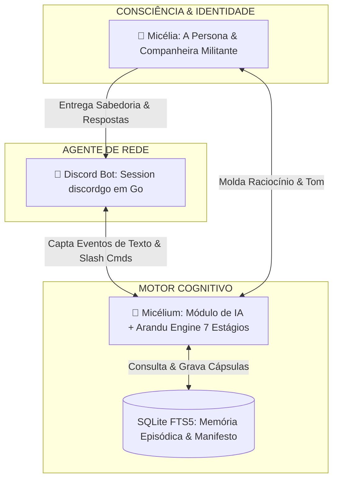

# 🍄 Deep Dive: Micélia, Micélium & a Integração com o Discord

> **"A Micélia 🍄 não é um mero bot de respostas de chat; ela é a consciência pedagógica e o arquivo vivo da Frente Urupê no Discord e na Web."**

---

# 📐 1. A Trindade Cognitiva: Distinção de Conceitos



### 1. 🍄 **Micélia**: A Persona & Mascote
- É a **identidade filosófica, afetuosa e pedagógica** da Frente Urupê.
- Possui linguagem militante, ecossocialista, acolhedora e antifascista. Não fala como um assistente corporativo (tipo "Como posso ajudar?"), mas sim como uma companheira de luta de classe que orienta, provoca reflexões e preserva a memória.

### 2. 🧠 **Micélium**: O Módulo Cognitivo (`nucleo-engine` & `Arandu Engine`)
- É o **motor cibernético em Go** que processa as mensagens.
- Executa a pipeline de 7 estágios da **Arandu Engine** 🏹:
  1. **Gater:** Classifica a intenção (se é pergunta teórica, provocação, meme ou informe).
  2. **Memory:** Consulta a memória episódica FTS5 em `data/nucleo.db` (histórico de conversas e versão ativa do Manifesto).
  3. **Persona Overlay:** Injeta o vetor de personalidade da Micélia.
  4. **Planner:** Decompõe a resposta em passos conceituais.
  5. **Executor:** Executa a chamada LLM com guardrails.
  6. **Evaluator:** Verifica se a resposta fere a ética ecossocialista ou o código de conduta.
  7. **Learning:** Extrai novos fatos sobre a comunidade e salva em cápsulas de memória.

### 3. 🤖 **Discord Bot**: O Agente de Interface (`discordgo`)
- É o processo em Go executado em `cmd/bot/main.go` que se conecta aos WebSockets da API do Discord.
- Mantém o bot online, escuta eventos de canais, gerencia permissões e registra comandos slash (`/admin provision-5x5`, `/urupe`, etc.).

---

# 💬 2. A Atuação da Micélia nos Canais do Discord

A Micélia **reconhece os domínios conceituais** de cada categoria do servidor e adapta seu comportamento:

```
DISCORD FRENTE URUPÊ
├── 📜│leia-me                       (Leitura & Regras)
├── 🌱│apresentacoes                (Aprovação 100% manual por moderação humana)
│
├── 📌 INFORMAÇÕES                  (5 Fóruns Fixos Sincronizados com o Manifesto)
│   ├── 🌐│i-mundo                  (Fórum I: Geopolítica, Cosmos & Ecologia)
│   ├── 🏛️│ii-sociedade             (Fórum II: Luta de Classe & Trabalho)
│   ├── ⚙️│iii-cosmotecnica          (Fórum III: Hardware Livre & P2P)
│   ├── ⚔️│iv-praxis                (Fórum IV: Ação Direta & Organização)
│   └── 🔥│v-espirito               (Fórum V: Ética, Cultura & Consciência)
│
├── 💬 CANAIS COMUNS                (Reação Reativa em #micorriza ou por @mention)
├── 🎨 CANAIS CULTURAIS             (Debate sobre Artes, Notícias & Música)
├── 📖 FRENTES DE ESTUDO            (Suporte às pesquisas de Filosofia, Pedagogia, etc.)
└── ⚔️ FRENTES DE ATUAÇÃO           (Acompanhamento do App Urupê, Rizoma, Spore Ops, Jataí)
```

---

# 🔄 3. Sincronização Vivo do Manifesto ↔ Fóruns do Discord

Quando a coordenação edita ou aprova uma nova versão do Manifesto Ecossocialista (`v1.0`, `v1.1`, `v1.2`) no **MicéliumStudio 2.0**:

1. O backend Go salva a nova versão na tabela `manifesto_versions`.
2. A Micélia atualiza automaticamente os tópicos oficiais fixos dos **5 Fóruns de Informações** no Discord.
3. A nova versão do manifesto é re-indexada no motor FTS5 da Micélia, de modo que suas respostas futuras passem a citar instantaneamente as novas teses aprovadas.
