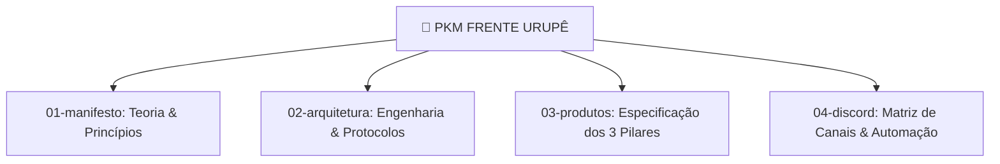

# 🧠 Base de Conhecimento & PKM: Frente Urupê

> **"Organização do Conhecimento, Teoria Política, Arquitetura de Software e Especificação de Produtos."**

Bem-vindo à base de conhecimento central (PKM - *Personal Knowledge Management*) da **Frente Urupê**. Este diretório reúne a fundamentação teórica, os blueprints arquiteturais, os documentos de visão de produto e a matriz do Discord.

---

## 🗺️ Mapa de Navegação PKM

---

## 📜 1. Manifesto & Fundamentação Teórica (`docs/01-manifesto/`)
Documentos que definem o imperativo histórico e a visão ecossocialista da Frente Urupê.

- 📄 [manifesto_ecossocialista.pdf](file:///home/ale/Projects/rede-urupe/docs/01-manifesto/manifesto_ecossocialista.pdf) — **[PDF do Manifesto]** Documento mestre das 5 Dimensões Ontológicas em formato PDF.
- 📄 [manifesto.md](file:///home/ale/Projects/rede-urupe/docs/01-manifesto/manifesto.md) — O Manifesto Ecossocialista por uma Soberania Digital Popular.
- 📄 [resumo.md](file:///home/ale/Projects/rede-urupe/docs/01-manifesto/resumo.md) — Síntese executiva das teses fundacionais.
- 📄 [metodo.md](file:///home/ale/Projects/rede-urupe/docs/01-manifesto/metodo.md) — O método de organização popular e soberania tecnológica.
- 📄 [leitura-esoterica.md](file:///home/ale/Projects/rede-urupe/docs/01-manifesto/leitura-esoterica.md) — Leitura mística, micelial e cosmotécnica da resistência.

---

## 🏗️ 2. Arquitetura & Engenharia (`docs/02-arquitetura/`)
Desenho técnico da infraestrutura descentralizada, backend Go e nó Rizoma P2P.

- 📄 [visual_identity_guidelines.md](file:///home/ale/Projects/rede-urupe/docs/02-arquitetura/visual_identity_guidelines.md) — **[Manual de Identidade Visual]** Tokens de cor OKLCH, tipografia e regras estéticas Gruvbox.
- 📄 [convocacao.pdf](file:///home/ale/Projects/rede-urupe/docs/02-arquitetura/convocacao.pdf) — **[Asset Pôster Convocação]** PDF Agitprop v3 L-to-R com manifesto e arquitetura em 1 página.
- 📄 [ramos_do_ecossistema.md](file:///home/ale/Projects/rede-urupe/docs/02-arquitetura/ramos_do_ecossistema.md) — **[Definição de Ramos]** Estrutura dos 2 ramos principais (Núcleo Urupê e App Urupê).
- 📄 [revolucao_rede_urupe.md](file:///home/ale/Projects/rede-urupe/docs/02-arquitetura/revolucao_rede_urupe.md) — Manifesto técnico e revolução da arquitetura da malha.
- 📄 [plano_fase2_rizoma_p2p.md](file:///home/ale/Projects/rede-urupe/docs/02-arquitetura/plano_fase2_rizoma_p2p.md) — Plano detalhado de engenharia P2P local-first em Rust (*Rizoma Box*).
- 📄 [nucleo_urupe_1_2_refinamento.md](file:///home/ale/Projects/rede-urupe/docs/02-arquitetura/nucleo_urupe_1_2_refinamento.md) — Especificação técnica do **Núcleo Urupê 1.2** (Versionamento do Manifesto, Estúdio Micélium 🍄 e Ops).

---

## 📱 3. Produtos do Ecossistema (`docs/03-produtos/`)
Detalhamento profundo da Trindade de Produtos da Frente Urupê.

- 📄 [deep_dive_product_pillars.md](file:///home/ale/Projects/rede-urupe/docs/03-produtos/deep_dive_product_pillars.md) — Análise minuciosa dos pilares: Núcleo Urupê, Rizoma Engine e App Urupê.
- 📄 [proposta-teorica-e-arquitetura.md](file:///home/ale/Projects/rede-urupe/docs/03-produtos/proposta-teorica-e-arquitetura.md) — Conexão entre a teoria ecossocialista e os módulos de software.

---

## 🏛️ 4. Matriz do Discord & Bot (`docs/04-discord/`)
Estrutura enxuta do servidor do Discord e integração com a mascote IA **Micélia 🍄**.

- 📄 [micelia_micelium_discord_deepdive.md](file:///home/ale/Projects/rede-urupe/docs/04-discord/micelia_micelium_discord_deepdive.md) — **[Deep Dive]** Estudo profundo da cognição da Micélia, motor Micélium e o Bot.
- 📄 [matriz_discord_urupe.md](file:///home/ale/Projects/rede-urupe/docs/04-discord/matriz_discord_urupe.md) — A matriz enxuta oficial (`#emoji│nome-do-canal`), 5 Fóruns do Manifesto e zero voz.
- 📄 [integracao_nucleo_discord.md](file:///home/ale/Projects/rede-urupe/docs/04-discord/integracao_nucleo_discord.md) — Especificação da ponte cibernética entre o backend Go, o Console Admin e o Discord.
